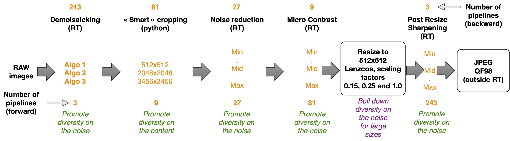

<h2 style='color:red;'> About the construction of our sources</h2>

From 1115 RAW images coming from the same sensor and captured with ISO>1000, we derived a grid of sources following the protocol detailed in the section III of the article.

The 1115 Images are coming from the [ALASKA](https://alaska.utt.fr) Database and some details about them are shared in the csv file ```RAW_DATABASE``` located at the root of this repo.

Our experimental protocol is also summed up by the following scheme :



Concerning the implementation, each source is defined by a yaml config representing a pipeline and containing all the hyperparameters listed above. The config file ```example.yaml``` provides an example of the expected format of each config file.

Remarks : 

- The cropping operation is done using the smart-cropping algorithm released for the challenge ALASKA 2 which selects the most textured crop among the possible candidates. It is available in the script ```image_conversion_fun.py``` downloadable with the command :

" ```wget http://alaska.utt.fr/ALASKA_v2_RAWs_scripts.zip --no-check-certificate``` "

**You need to download this script to be able to run ours**

- The final jpeg compression is done using image-magick to better control it.

- All the other operations are done using [rawtherapee](https://www.rawtherapee.com).

The code enabling to create a source from a set of RAW pictures and a yaml config file is in the function ```develop_raw_pictures``` available in the script ```develop.py``` . Don't hesitate to try it with your own RAWs.

